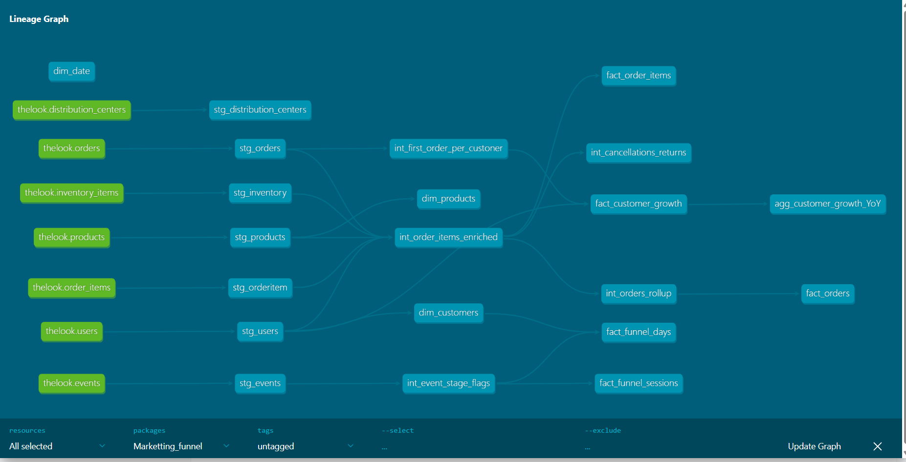
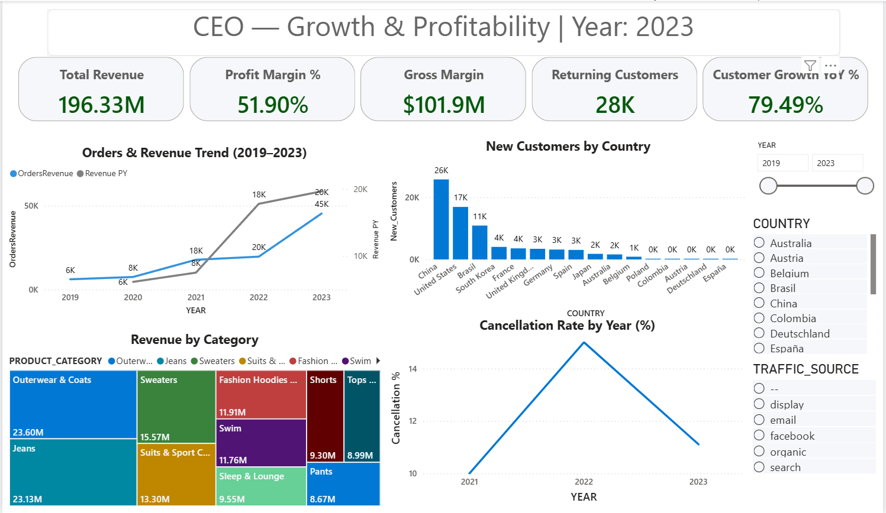
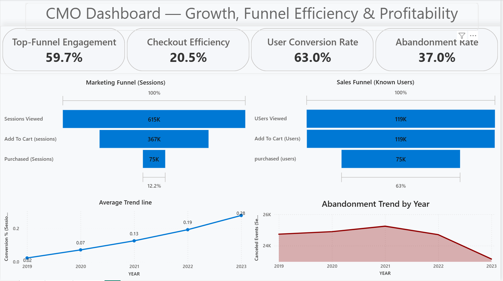
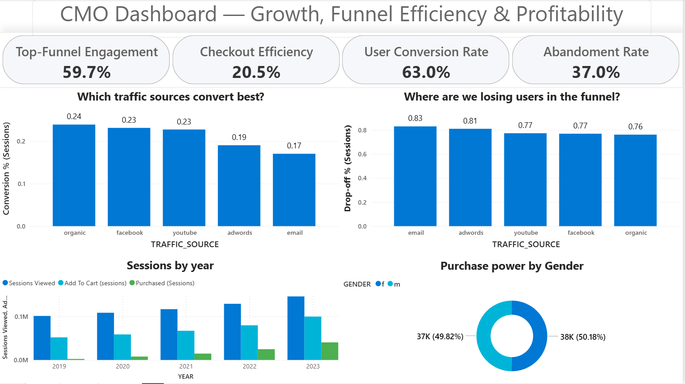

#  Marketing-to-Revenue Funnel Analytics  
**Tech Stack:** Snowflake | dbt | Power BI | GitHub | SQL  
## Lineage & Documentation

**Explore the interactive dbt Lineage Graph here:**  
 [View Lineage in dbt Cloud]( https://ibttihal-94.github.io/DBT_Snowflake_thelook_ecommerce/)
 

---

##  Project Overview
This project demonstrates an end-to-end **modern analytics pipeline** for an e-commerce company (“TheLook / Milo Store”).  
It shows how raw transactional data from multiple sources can be modeled, tested, and visualized to help executives answer key business questions such as:

- Where are we **losing potential revenue** in the funnel?  
- Which **products, countries, and customer segments** drive sustainable growth?  
- How do **returns, cancellations, and margins** affect profitability?  
- What are the **marketing conversion rates** across traffic sources and devices?

---

##  Architecture
```text
CSV / External Sources
        ↓
Snowflake (RAW Layer)
        ↓
dbt (STAGING → INTERMEDIATE → MARTS)
        ↓
Power BI (Executive Dashboards)
```

---

## Schema Structure

### Facts
- **`fact_order_items`** – Revenue, cost, margin per SKU  
- **`fact_orders`** – Order-level performance  
- **`fact_funnel_sessions`** – Anonymous visitor stages  
- **`fact_funnel_days`** – Customer-level funnel tracking  
- **`fact_customer_growth`** – New customers & YoY trend  

### Dimensions
- **`dim_date`** – Calendar hierarchy  
- **`dim_products`** – Product metadata (brand, category, department)  
- **`dim_customers`** – Demographics & traffic source  

All models follow a **star schema** for Power BI reporting, ensuring clear relationships and efficient aggregation.

---

## Tools Used

| Tool | Purpose |
|------|----------|
| **Snowflake** | Cloud data warehouse for scalable storage & compute |
| **dbt Core** | Data transformation, testing, and modular SQL modeling |
| **Power BI Desktop** | Executive dashboards and visual analytics |
| **Git + GitHub** | Version control and portfolio publishing |
---

## Executive Dashboards & Key Insights
### CEO — Growth & Profitability

#### Highlights

**Total Revenue:** ~$196.3M with Gross Margin ~51.9% ⇒ strong profitability.

**Customer Growth YoY:** ~79.5% — China, United States, Brazil lead new customers.

**Top Revenue Categories:** Outerwear & Coats (~$23.6M), Jeans (~$23.1M), Sweaters (~$15.5M).

**Cancellation Rate** improved from ~16% (2022) to ~11% (2023).


---

### CMO — Funnel Efficiency & Source Performance (Page 1)

#### Highlights

**Top-Funnel Engagement:** ~59.7% of sessions view products.

**Checkout Efficiency:** ~20.5% → ~1 in 5 carted sessions purchase.

**User Conversion (known users):** ~63%.

**Abandonment Rate:** ~37% overall.

**Conversion trend** rose from ~2% → ~28% (2019–2023).



---

### CMO — Which Sources Win? Where Do We Lose? (Page 2)

#### Highlights

**Best-converting sources:** Organic (24%), Facebook (23%), YouTube (23%).

**Weak sources:** Email (17%), AdWords (19%) with highest drop-offs (>80%).

**Balanced demand:** Purchase power is ~50/50 by gender.

Sessions, carts, and purchases grow steadily through 2023.



---
## Key Takeaways

**Conversion-led growth:** checkout efficiency + rising conversion = meaningful revenue lift.

**Channel optimization:** Organic/Social outperform; Email/AdWords require content & targeting fixes.

**Profitable scale:** Revenue and customers nearly doubled since 2020 while maintaining ~52% margin.

**Balanced audience:** Gender spend is evenly split → broad market appeal.

---
---

## 🛡️ Data Privacy & GDPR Compliance

As this project models user-level and behavioral data (sessions, purchases, and funnel events), it follows **GDPR-aligned data handling principles** used by EU analytics teams:

- **Data Minimization:** Only analytics-relevant attributes are modeled in dbt; personally identifiable information (PII) such as emails, addresses, and full names are excluded from Power BI outputs.
- **Pseudonymization:** User identifiers (`user_id`) are stored as surrogate keys (`customer_sk`) to prevent direct identification.
- **Purpose Limitation:** Data is processed exclusively for aggregated analytics, growth measurement, and marketing funnel optimization — not for profiling or direct marketing.
- **Access Management:** The architecture separates *RAW → STAGING → MARTS* layers, ensuring only anonymized, aggregated marts feed executive dashboards.
- **Right to Erasure & Access:** The schema supports easy deletion or retrieval of user data through `user_id` traceability from marts back to raw.

By incorporating these principles, the project demonstrates how **modern analytics pipelines** can remain **compliant with EU GDPR** while still providing full-funnel visibility and actionable insights.

---
## Power BI Relationships (single-direction, dim → fact)

dim_date[date_day] → fact_funnel_sessions[date_day]

dim_date[date_day] → fact_funnel_days[date_day]

dim_date[date_day] → fact_orders[date_day]

dim_date[date_day] → fact_order_items[date_day]

dim_date[date_day] → fact_customer_growth[date_key]

dim_customers[customer_sk] → fact_funnel_days[customer_sk]

dim_customers[customer_sk] → fact_orders[customer_sk]

(Do not relate dim_customers to fact_funnel_sessions — contains anonymous visitors.)